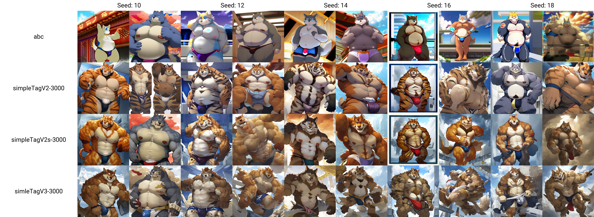
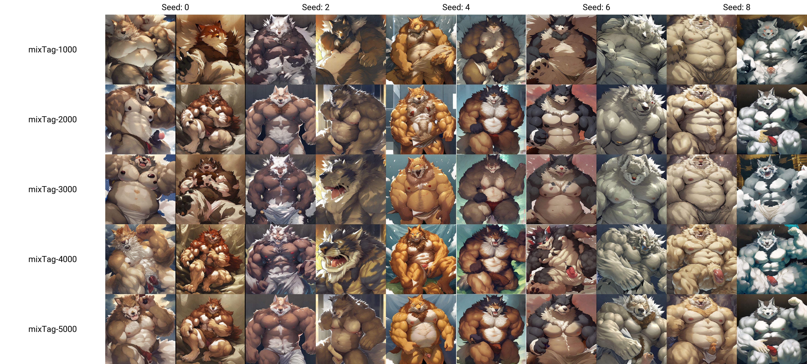
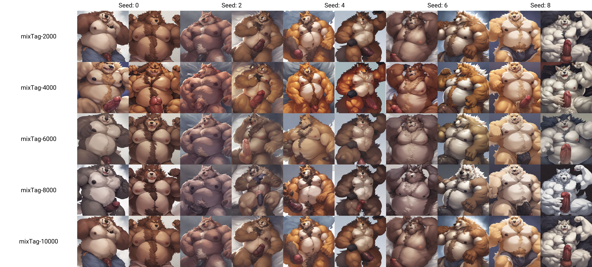
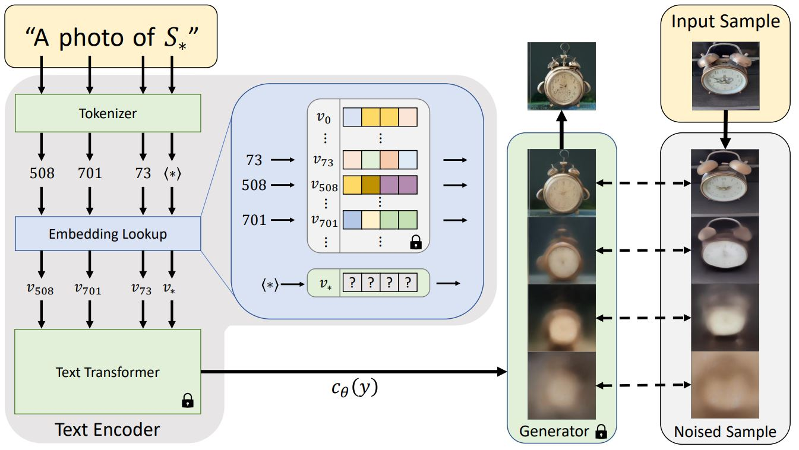

# 一、Reowoof

|              | reowoofTag | reowoofTagV2 | reowoofV3 |
| ------------ | ---------- | :----------- | --------- |
| 词向量       | 16         | 16           | 8         |
| 训练模型     | Yiff18     | Yiff18       | Yiff18    |
| CLIP SKIP    | 1          | 2            | 2         |
| 训练步数     | 3000       | 3000         | 3000      |
| ——训练图——   |            |              |           |
| 图片数量     | 22         | 22           | 21        |
| 焦点面部权重 | 0.9        | 1            | 1         |
| 显眼文字比例 | 15%        | 0%           | 0%        |
| 单人图比例   | 90%        | 90%          | 90%       |
| 简单背景比例 | 95%        | 95%          | 95%       |


## 图示


# 二、simpleTag

|                    | simpleTagV2        | simpleTagV2s       | simleTagV3         |
| ------------------ | ------------------ | ------------------ | ------------------ |
| 词向量             | 16                 | 16                 | 16                 |
| 训练模型           | YiffV2 20-8 NoSkip | YiffV2 20-8 NoSkip | YiffV2 20-8 NoSkip |
| CLIP SKIP          | 1                  | 1                  | 1                  |
| 训练步数           | 5000               | 5000               | 5000               |
| 使用TAG            | 无                 | deepbooru-webui*   | e621 tag*          |
| ——训练图——         |                    |                    |                    |
| 图片数量           | 198                | 198                | 198                |
| 焦点面部权重       | 1.0                | 1.0                | 1.0                |
| 显眼文字、符号比例 | 0%                 | 0%                 | 0%                 |
| 单人图比例         | 83.3%              | 83.3%              | 83.3%              |
| 简单背景比例       | 100%               | 100%               | 100%               |
| 图片大小           | 448*448            | 448*448            | 448*448            |

deepbooru-webui*：反推：deepbooru 分数阈值 为0.75，并且没替换_为空格

E621 Tag*代表去除了画家与版权tag 并且按照物种、普通标签排序


simpleTagV2在具体且足够多的标签下也能画的不模糊


**下次改进措施**：

- 图片大小改为496*496 (尽可能贴近512 * 512等标准分辨率)
- 删除没有细节的图（比如草稿）
- 去除e621标签中的meta
- 尝试二段式训练：先训练简单背景图片，调低学习率后再训练复杂背景图片


更进一步只保留e621的种族标签


分支选项：自动打标签


图示：

```
wallpaper,4k,anime,ultra detailed,
kemono,fat,wolf,detailed face and blue eyes,underwear,bulge,
detailed background,sky,onsen,
abc
Negative prompt: nsfw,bad,death,messy
Steps: 20, Sampler: DDIM, CFG scale: 7, Seed: 6, Size: 512x512, Model: yai2.1.10NoSkip, Batch size: 2, Batch pos: 0
```


```
wallpaper,4k,anime,ultra detailed,
kemono,fat,wolf,detailed face and blue eyes,underwear,bulge,
detailed background,sky,onsen,
abc
Negative prompt: nsfw,bad,death,messy
Steps: 20, Sampler: DDIM, CFG scale: 7, Seed: 14, Size: 512x512, Model: yai2.1.10NoSkip, Batch size: 2, Batch pos: 0
```





```
wallpaper,anime,ultra detailed,
kemono,wolf,musclar,detailed face and blue eyes,clothing, 
detailed background,sky,
simleTagV3-3000
Negative prompt: nsfw,sex,bad,death,messy
Steps: 20, Sampler: DDIM, CFG scale: 7, Seed: 18, Size: 512x512, Model: yai2.1.10NoSkip, Batch size: 2, Batch pos: 0
```


```
anime,ultra detailed,
kemono,canine,wolf,big muscles,black nose,bulge,claws,clothed,clothing,fangs,grey body,grey fur,nipples,obliques,open mouth,smile,solo,standing,teeth,thick thighs,toe claws,tongue,topless,triceps,underwear,vein,
yellow sclera,simple background,
simpleTagV2-3000
Negative prompt: bad,death,messy
Steps: 20, Sampler: DDIM, CFG scale: 7, Seed: 0, Size: 512x512, Model: yai2.1.10NoSkip, Batch size: 2, Batch pos: 0

Used embeddings: simpleTagV2-3000 [322f]
```


```
simpleTagV2-3000
Steps: 20, Sampler: DDIM, CFG scale: 7, Seed: 0, Size: 512x512, Model: yai2.1.10NoSkip, Batch size: 2, Batch pos: 0

Used embeddings: simpleTagV2-3000 [322f]
```


# 三、Mix

|                    | mixTagV1           | mixTagV2           | mixTagV3           | mixTagV4           | mixTagV4s          |
| ------------------ | ------------------ | ------------------ | ------------------ | ------------------ | ------------------ |
| 词向量             | 16                 | 16                 | 16                 | 16                 | 16                 |
| 训练模型           | YiffV2 20-8 NoSkip | YiffV2 20-8 NoSkip | YiffV2 20-8 NoSkip | YiffV2 20-8 NoSkip | YiffV2 20-8 NoSkip |
| CLIP SKIP          | 1                  | 1                  | 1                  | 1                  | 1                  |
| 训练步数           | 10000              | 9450               | 9450               | 9450               | 9450               |
| 训练轮数           | 18轮               | 18轮               | 18轮               | 18轮               | 18轮               |
| 使用TAG            | e621 tag           | 无TAG              | e621 tag           | e621 tag           | e621 tag           |
| 学习率             | 0.005(全程)        | 0.005(全程)        | 0.005(全程)        | 0.005(全程)        | 0.005(全程)        |
| ——训练图——         |                    |                    |                    |                    |                    |
| 图片数量           | 525                | 525                | 525                | 525                | 525                |
| 焦点面部权重       | 1.0                | 1.0                | 1.0                | 1.0                | 1.0                |
| 显眼文字、符号比例 | 0%                 | 0%                 | 0%                 | 0%                 | 0%                 |
| 单人图比例         | 95%                | 95%                | 95%                | 95%                | 95%                |
| 简单背景比例       | 40%                | 40%                | 40%                | 40%                | 40%                |
| 图片大小           | 496*496            | 496*496            | 496*496            | 496*496            | 496*496            |
| ——标签——           |                    |                    |                    |                    |                    |
| 总数量             | 159                | 0                  | 117                | 56                 | 200                |
| 种族数量           | 159                | 0                  | 22                 | 5                  | 159                |
| 普通数量           | 0                  | 0                  | 95                 | 49                 | 41                 |
| ——训练结果——       |                    |                    |                    |                    |                    |
| 区间平均Loss       | 5.5-10k:0.358      | 5-9k:0.361         | 5-9k:0.422         | 5-9k:0.411         |                    |

## 改进措施

- 上云！上谷歌云盘来解决训练时长过长问题
- 增加Git仓库，存储训练结果
- 训练图片大小设置为512*512
- 增加标签数量与训练图片
- 训练轮数控制到18轮


## 图示





```
anime,kemono
fat,wolf,body hair,detailed fluffy fur,detailed face and eyes,
mixTag-2000
Negative prompt: blush,clothing,blurry,extra body parts,back,extra limb,extra balls,overlapping body,messy,deformed body,death,mark,watermark,sign,logo,signature
Steps: 20, Sampler: DDIM, CFG scale: 7, Seed: 0, Size: 512x512, Model: YiffAI V2 20-8NoSkip, Batch size: 2, Batch pos: 0

Used embeddings: mixTag [06c3]
```





```
基于YAi2.1模型
```


```
anime,kemono,masterpiece,best quality,ultra detailed,
fat,wolf,body hair,detailed fluffy fur,detailed face and eyes,white underwear,bulge,
smile, sitting,in the hot spring, sky,
detailed background,atmosphere,blurred background,blurred foreground,dramtic shadow,ray tracing,
mixTagV2-2000,
Negative prompt: nsfw,bad,blush,extra body parts,back,extra limb,extra balls,messy,deformed body,death,mark,watermark,sign,logo,signature
Steps: 20, Sampler: DDIM, CFG scale: 7, Seed: 20, Size: 512x512, Model: YiffAI V2 20-8NoSkip, Batch size: 2, Batch pos: 0

Used embeddings: mixTagV2-2000 [c842]
```


### 各版本对比


首先Tiger wolf lion肯定都能画出来不会出现种族不对劲问题

我翻了一下loss mixtag最后训练loss比较低啊 mixTagv3比它高


```
kemono,
musclar,canine+wolf,body hair,detailed fluffy fur,detailed face and eyes,
penis+explict,precum,excessive precum,huge balls,saggy balls,
mixTag-4000
Negative prompt: blush,clothing,blurry,extra body parts,back,extra limb,extra balls,overlapping body,messy,deformed body,death,mark,watermark,sign,logo,signature
Steps: 20, Sampler: DDIM, CFG scale: 7, Seed: 4184930995, Size: 768x768, Model: YiffAI V2 20-8NoSkip, Batch size: 2, Batch pos: 0

Used embeddings: mixTag-4000 [1953]
```


### Huge Balls标签对比

v1 4张；v2 2张；v3 5张

v3标签似乎更能体现huge balls的标签


## 总结：

MixV3更能描述标签的关系，但标签数量还是过高，导致loss居高不下


## 改进措施V2:

- 改进算法，降低标签数量
- 提升分辨率


# 四、Cloud

|                    | cloud         | cloudV2     |
| ------------------ | ------------- | ----------- |
| 词向量             | 16            | 16          |
| 训练模型           | Yiffe18       | Yiffe18     |
| CLIP SKIP          | 1             | 1           |
| 训练步数           | 3330 (185*18) | 9450-(中止) |
| 训练轮数           | 18轮          | 18轮        |
| 使用TAG            | e621 tag*     | e621 tag*+  |
| 学习率             | 0.005(全程)   | 0.005(全程) |
| ——训练图——         |               |             |
| 图片数量           | 185           | 525         |
| 焦点面部权重       | 1.0           | 1.0         |
| 显眼文字、符号比例 | 0%            | 0%          |
| 单人图比例         | 86%           | 95%         |
| 简单背景比例       | 100%          | 40%         |
| 图片大小           | 512*512       | 448*448     |

e621 tag*只保留种族标签

felid,lion,mammal,pantherine,tiger

canid,canine,canis,mammal,wolf


+保留种族与普通标签，但每张图标签数量有根据算法进行缩减

该embedding 两个效果都不怎么好怀疑是模型问题


mixTag在768*768分辨率下 面部不糊 很神奇


## 改进措施

- 一定要用yai2.0以上版本训练！
- 图片大小可尝试768*768分辨率
- 记得自动保存pt文件到gdriver


# 五、Top

实际出图步数跟标签数量与图片数量有关，没有标签数量 和很少的图片 大概1000步就能出图

|                        | topV1              | topV2              | topV2a      | topV2b             | topV2c             |
| ---------------------- | ------------------ | ------------------ | ----------- | ------------------ | ------------------ |
| 词向量                 | 16                 | 16                 | 32          | 8                  | 64                 |
| 训练模型               | YiffV2 20-8 NoSkip | YiffV2 20-8 NoSkip | SD1.4       | YiffV2 20-8 NoSkip | YiffV2 20-8 NoSkip |
| ~~CLIP SKIP~~          |                    |                    |             |                    |                    |
| 训练步数               | 9450               | 9450               | 5250        | 5250               | 5250               |
| 训练轮数               | 18轮               | 18轮               | 10轮        | 10轮               | 10轮               |
| 使用TAG                | e621 tag           | e621 tag           | e621 tag    | e621 tag           | e621 tag           |
| 学习率                 | 0.005(全程)        | 0.005(全程)        | 0.005(全程) | 0.005(全程)        | 0.005(全程)        |
| ——训练图——             |                    |                    |             |                    |                    |
| 图片数量               | 525                | 525                | 525         | 525                | 525                |
| 焦点面部权重           | 不使用             | 1.0                | 1.0         | 1.0                | 1.0                |
| ~~显眼文字、符号比例~~ |                    |                    |             |                    |                    |
| 单人图比例             | 95%                | 95%                | 95%         | 95%                | 95%                |
| 简单背景比例           | 40%                | 40%                | 40%         | 40%                | 40%                |
| 图片大小               | 768*768            | 472*472            | 472*472     | 512*512            | 512*512            |
| ——标签——               |                    |                    |             |                    |                    |
| 总数量                 | 192                | 172                | 172         | 172                | 172                |
| 种族数量               | 159                | 159                | 159         | 159                | 159                |
| 普通数量               | 33                 | 13                 | 13          | 13                 | 13                 |
| ——训练结果——           |                    |                    |             |                    |                    |
| 区间平均Loss           |                    | 5-9k:0.351         |             |                    |                    |


# 知识

文本->图像 要经过编码

编码是以词元化形式然后通过embedding lookup来输入生成器的

那么文本反转，就是由图像来生成文本

生成具体什么？生成对应的token对应的向量处理？


# 标签

标签指导了怎么拆分这张图片中的元素，

如果拆分的元素过多，那么会导致用户单个标签进行描述时候画面会糊

其实本质是比例。如果各个标签比例能达到某一阈值 拆分的元素过多也不怕





In the text-encoding stage of most text-to-image models, the first stage involves converting the prompt into a numerical representation. This is typically done by converting the words into tokens, each equivalent to an entry in the model's dictionary. These entries are then converted into an "embedding" - a continuous vector representation for the specific token. These embeddings are usually learned as part of the training process. In our work, we find new embeddings that represent specific, user-provided visual concepts. These embeddings are then linked to new pseudo-words, which can be incorporated into new sentences like any other word. In a sense, we are performing inversion into the text-embedding space of the frozen model. We're calling the process 'Textual Inversion'.


在大多数文本到图像模型的文本编码阶段，第一阶段涉及将提示转换为数字表示。这通常是通过将单词转换为令牌来完成的，每个令牌相当于模型字典中的一个条目。然后，这些条目被转换为 "嵌入"--特定标记的连续矢量表示。这些嵌入通常是作为训练过程的一部分来学习的。在我们的工作中，我们找到新的嵌入，代表特定的、用户提供的视觉概念。然后，这些嵌入被链接到新的伪词，这些伪词可以像其他词一样被纳入新的句子中。在某种意义上，我们正在对冻结模型的文本嵌入空间进行反转。我们把这个过程称为 "文本反转"。


# 对比流程

制定对比项目

```
anime,kemono,masterpiece,best quality,ultra detailed,
anthro,male/male,lion,sitting,hand on coffee,
male/male as (fat+body hair+detailed fluffy fur+detailed face and eyes+(white underwear+bulge)),
in the hot spring,sky,detailed background,warm atmospheres,blurred background,blurred foreground,
sunset,dramtic shadow,ray tracing,
topV2-6300
Negative prompt: nsfw,bad,blush,extra body parts,back,extra limb,extra balls,messy,deformed body,death,mark,watermark,sign,logo,signature
Steps: 20, Sampler: Euler a, CFG scale: 9, Seed: 2931137582, Size: 512x512, Model: YiffAI V2 20-8NoSkip, Batch size: 2, Batch pos: 0

Used embeddings: topV2-6300 [d353]
```


能根据用户输入随心所欲

越少的标签就能画出越好的图片，

并且越多的标签能越提升细节


## 种族对比

按照TAGS排名

最受欢迎的是哺乳动物，其中犬科与猫科是遥遥领先者

dragon也有很多

domestic dog,wolf,tiger,lion,dragon


### 评价标准？

对比种族的还原力，每次能感受到明显区分则+1，以百分比来显示

对比出图质量 质量高+1


各列不符合的：3，2，2，0


各列不符合的：3，1，2，0


topV2-9450 +1


基于Euler a采样器与DDIM采样器


## 体型对比

muscular,big muscular,slightly chubby,overweight,musclegut


不符合：4,1,6,6


不符合：4，6，3，5

topV2-3675:+1

## 衣服对比

underwear,loincloth,coat,shirt,pants,shorts


7，2，3，3


6，3，5，5


topV2-3675:1

## R-18对比


符合标准1，1，1，2


9450+1


## 背景对比

detailed background+city,detailed background+sea,detailed background+room


6825+1

9450+1


## 多人对比


都没有


## 细节对比

anime,kemono,masterpiece,best quality,ultra detailed,
anthro,solo,lion,sitting,hand on coffee,
lion as (fat+body hair+detailed fluffy fur+detailed face and eyes+(white underwear+bulge)),
in the hot spring,sky,detailed background,warm atmospheres,blurred background,blurred foreground,
sunset,dramtic shadow,ray tracing,
topV2-525


# 联动对比


# Anime——目前最好

|                  | AnimeV1            | AnimeV2            |
| ---------------- | ------------------ | ------------------ |
| 词向量           | 32                 | 64                 |
| 训练模型         | YiffV2 20-8 NoSkip | YiffV2 20-8 NoSkip |
| 训练步数         | 5620               | 5620               |
| 训练轮数         | 10轮               | 10轮               |
| 使用TAG          | e621 tag           | e621 tag           |
| 学习率           | 0.005(全程)        | 0.005(全程)        |
| ——训练图——       |                    |                    |
| 图片数量         | 562                | 562                |
| ~~焦点面部权重~~ | 1.0                | 1.0                |
| ~~单人图比例~~   | 95~%               | 95~%               |
| ~~简单背景比例~~ | 40~%               | 40~%               |
| 图片大小         | 512*512            | 512*512            |
| ——标签——         |                    |                    |
| 总数量           | 229                | 229                |
| 种族数量         | 163                | 163                |
| 普通数量         | 66                 | 66                 |
| ——训练结果——     |                    |                    |
| Epoch平均Loss    | 10轮内：0.394      | 10：0.373          |
| 最高loss         | 1686 第三轮:0.568  | 562\|1\|0.560      |
| 最低loss         | 3372 第六轮:0.218  | 1124\|2\|0.263     |


token 与标签匹配机制

如果tokens过多 而标签过少 将会导致画面奇怪

如果tokens过少 标签过多 画面变糊

| 输入 | 对比项1 | 对比项2 | 结论 |
| ---- | ------- | ------- | ---- |
|      | V1-3372 | V2-5620 |      |
|      |         |         |      |
|      |         |         |      |

