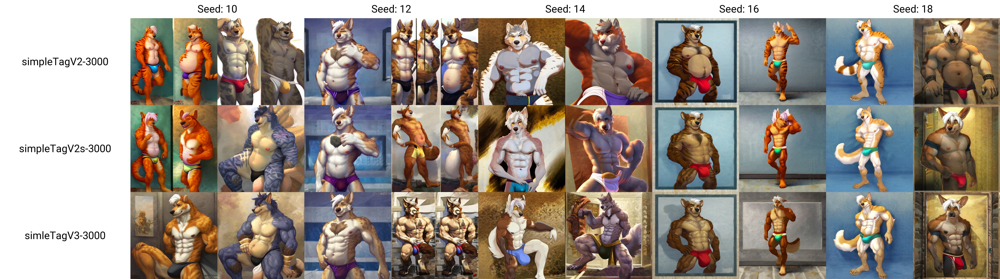

## 显眼符号与文字示例


# 一、Reowoof

|              | reowoofTag | reowoofTagV2 | reowoofV3 |
| ------------ | ---------- | :----------- | --------- |
| 词向量       | 16         | 16           | 8         |
| 训练模型     | Yiff18     | Yiff18       | Yiff18    |
| CLIP SKIP    | 1          | 2            | 2         |
| 训练步数     | 3000       | 3000         | 3000      |
| ——训练图——   |            |              |           |
| 图片数量     | 22         | 22           | 21        |
| 焦点面部权重 | 0.9        | 1            | 1         |
| 显眼文字比例 | 15%        | 0%           | 0%        |
| 单人图比例   | 90%        | 90%          | 90%       |
| 简单背景比例 | 95%        | 95%          | 95%       |


## 图示


# 二、simpleTag

|                    | simpleTagV2        | simleTagV2s        | simpleTagV3        |
| ------------------ | ------------------ | ------------------ | ------------------ |
| 词向量             | 16                 | 16                 | 16                 |
| 训练模型           | YiffV2 20-8 NoSkip | YiffV2 20-8 NoSkip | YiffV2 20-8 NoSkip |
| CLIP SKIP          | 1                  | 1                  | 1                  |
| 训练步数           | 5000               | 5000               | 5000               |
| 使用TAG            | 无                 | deepbooru-webui*   | e621 tag*          |
| ——训练图——         |                    |                    |                    |
| 图片数量           | 198                | 198                | 198                |
| 焦点面部权重       | 1.0                | 1.0                | 1.0                |
| 显眼文字、符号比例 | 0%                 | 0%                 | 0%                 |
| 单人图比例         | 83.3%              | 83.3%              | 83.3%              |
| 简单背景比例       | 100%               | 100%               | 100%               |
| 图片大小           | 448*448            | 448*448            | 448*448            |

deepbooru-webui*：反推：deepbooru 分数阈值 为0.75，并且没替换_为空格

E621 Tag*代表去除了画家与版权tag 并且按照物种、普通标签排序


simpleTagV2在具体且足够多的标签下也能画的不模糊


**下次改进措施**：

- 图片大小改为496*496 (尽可能贴近512 * 512等标准分辨率)
- 删除没有细节的图（比如草稿）
- 去除e621标签中的meta
- 尝试二段式训练：先训练简单背景图片，调低学习率后再训练复杂背景图片


更进一步只保留e621的种族标签


分支选项：自动打标签


图示：

```
wallpaper,4k,anime,ultra detailed,
kemono,fat,wolf,detailed face and blue eyes,underwear,bulge,
detailed background,sky,onsen,
abc
Negative prompt: nsfw,bad,death,messy
Steps: 20, Sampler: DDIM, CFG scale: 7, Seed: 6, Size: 512x512, Model: yai2.1.10NoSkip, Batch size: 2, Batch pos: 0
```


```
wallpaper,4k,anime,ultra detailed,
kemono,fat,wolf,detailed face and blue eyes,underwear,bulge,
detailed background,sky,onsen,
abc
Negative prompt: nsfw,bad,death,messy
Steps: 20, Sampler: DDIM, CFG scale: 7, Seed: 14, Size: 512x512, Model: yai2.1.10NoSkip, Batch size: 2, Batch pos: 0
```


```
wallpaper,anime,ultra detailed,
kemono,wolf,musclar,detailed face and blue eyes,clothing, 
detailed background,sky,
simleTagV3-3000
Negative prompt: nsfw,sex,bad,death,messy
Steps: 20, Sampler: DDIM, CFG scale: 7, Seed: 18, Size: 512x512, Model: yai2.1.10NoSkip, Batch size: 2, Batch pos: 0
```





```
anime,ultra detailed,
kemono,canine,wolf,big muscles,black nose,bulge,claws,clothed,clothing,fangs,grey body,grey fur,nipples,obliques,open mouth,smile,solo,standing,teeth,thick thighs,toe claws,tongue,topless,triceps,underwear,vein,
yellow sclera,simple background,
simpleTagV2-3000
Negative prompt: bad,death,messy
Steps: 20, Sampler: DDIM, CFG scale: 7, Seed: 0, Size: 512x512, Model: yai2.1.10NoSkip, Batch size: 2, Batch pos: 0

Used embeddings: simpleTagV2-3000 [322f]
```


```
simpleTagV2-3000
Steps: 20, Sampler: DDIM, CFG scale: 7, Seed: 0, Size: 512x512, Model: yai2.1.10NoSkip, Batch size: 2, Batch pos: 0

Used embeddings: simpleTagV2-3000 [322f]
```


# 三、Mix

|                    | mixTagV1           |
| ------------------ | ------------------ |
| 词向量             | 16                 |
| 训练模型           | YiffV2 20-8 NoSkip |
| CLIP SKIP          | 1                  |
| 训练步数           | 10000              |
| 训练轮数           | 18轮               |
| 使用TAG            | e621 tag*          |
| 学习率             | 0.005(全程)        |
| ——训练图——         |                    |
| 图片数量           | 525                |
| 焦点面部权重       | 1.0                |
| 显眼文字、符号比例 | 0%                 |
| 单人图比例         | 95%                |
| 简单背景比例       | 40%                |
| 图片大小           | 496*496            |


e621 tag*只保留种族标签

felid,lion,mammal,pantherine,tiger

canid,canine,canis,mammal,wolf


## 改进措施

- 上云！上谷歌云盘来解决训练时长过长问题
- 增加Git仓库，存储训练结果
- 训练图片大小设置为512*512
- 增加标签数量与训练图片
- 训练轮数控制到18轮


## 图示


```
anime,kemono
fat,wolf,body hair,detailed fluffy fur,detailed face and eyes,
mixTag-2000
Negative prompt: blush,clothing,blurry,extra body parts,back,extra limb,extra balls,overlapping body,messy,deformed body,death,mark,watermark,sign,logo,signature
Steps: 20, Sampler: DDIM, CFG scale: 7, Seed: 0, Size: 512x512, Model: YiffAI V2 20-8NoSkip, Batch size: 2, Batch pos: 0

Used embeddings: mixTag [06c3]
```


```
基于YAi2.1模型
```


